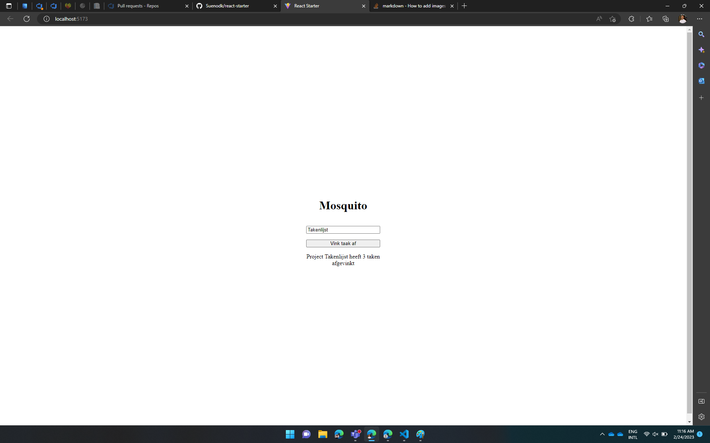

# Hello world
In deze challenge ga je een react component maken dat er ongeveer zo uit komt te zien:

Hierbij is het volgende van toepassing:
- Het input veld is gekoppeld aan een variabele `projectName` wanneer de waarde in dit veld wordt bijgewerkt wordt `projectName` ook bijgewerkt
- De button Vink taak af increased een variabele `tasksDone` bij 1
- De tekst onderaan bestaat uit het volgende template: "Project `projectName` heeft `tasksDone` taken afgevinkt"
- Deze tekst wordt bijgewerkt wanneer de variabele `projectName` of `tasksDone` wordt bijgewerkt.

Hier zijn de docs: https://reactjs.org/docs/getting-started.html. 

Succes!

## Opzet
Aan de linker kant zien we de src map met de `App.tsx` file.

- Maak onder de `src` folder een `components` folder aan
- Maak een nieuwe file aan in de components genaamd `HelloWorld.tsx`
- Maak het component HelloWorld aan met behulp van de volgende guidelines: https://reactjs.org/docs/components-and-props.html#function-and-class-components
- <b>Let op we maken gebruik van functional components!</b>
- Render het component vanuit de `App.tsx` file met behulp van de volgende guidelines: https://reactjs.org/docs/components-and-props.html#rendering-a-component

## FAQ
- Variabelen en state https://reactjs.org/docs/hooks-intro.html